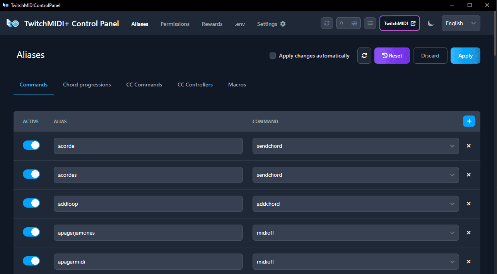

# TwitchMIDIControlPanelBin

This repository contains the binaries of TwitchMIDI Control Panel

> You NEED a TwitchMIDI+ license to use this software. Go to [https://store.rafaelpernil.com/l/twitchmidiplus](https://store.rafaelpernil.com/l/twitchmidiplus) to get yours.

# Table of Contents

- [TwitchMIDIControlPanelBin](#twitchmidicontrolpanelbin)
- [Table of Contents](#table-of-contents)
- [Downloads](#downloads)
- [Troubleshooting](#troubleshooting)
  - [macOS is not supported](#macos-is-not-supported)

# Downloads

Obtain the appropiate version for your operating system here!

[Windows](https://github.com/rafaelpernil2/TwitchMIDIControlPanelBin/releases/download/v3.0.0/TwitchMIDIControlPanel.exe)

[Linux](https://github.com/rafaelpernil2/TwitchMIDIControlPanelBin/releases/download/v3.0.0/TwitchMIDIControlPanel.AppImage)

# Troubleshooting

## macOS is not supported

A macOS version of TwitchMIDI Control Panel is not available. Distributing applications on macOS requires code signing with an Apple Developer certificate, which mandates enrollment in the Apple Developer Program — a paid annual subscription. Without this, macOS will block the application from running entirely, with no straightforward workaround for end users.

Until this requirement changes or an alternative distribution method becomes viable, macOS is not a supported platform.

